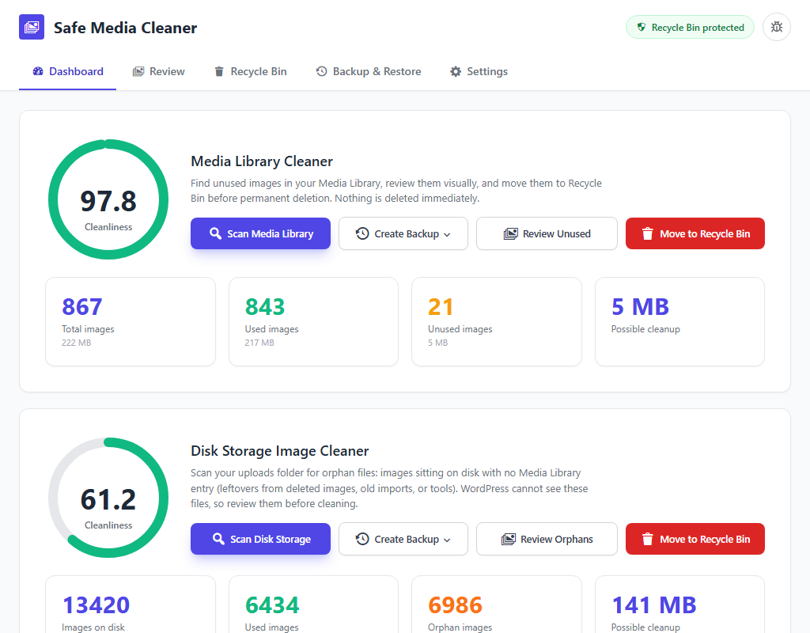
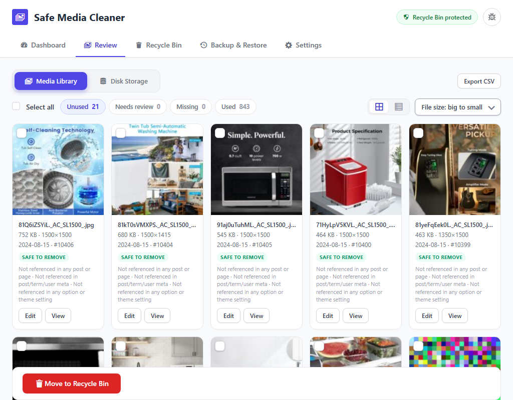
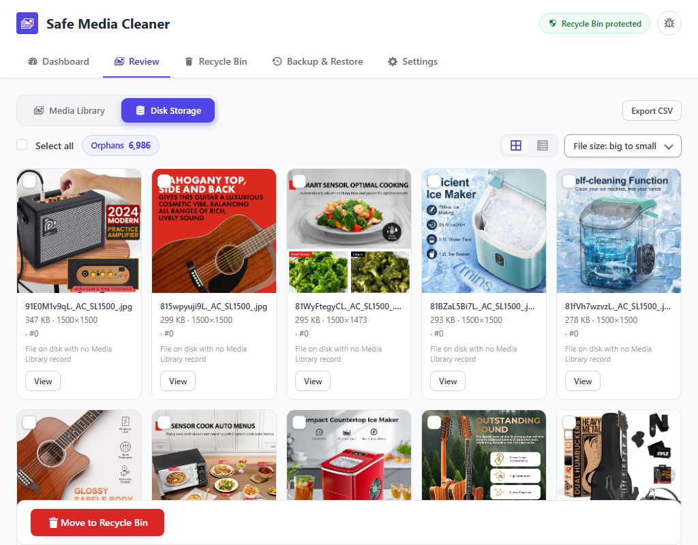
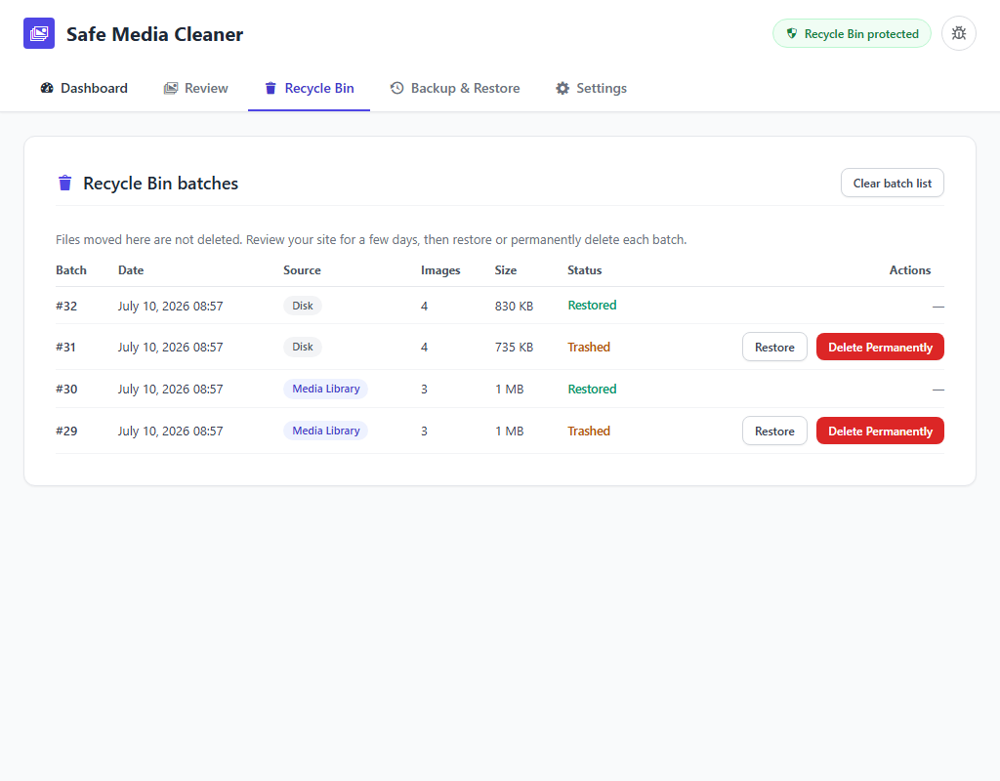
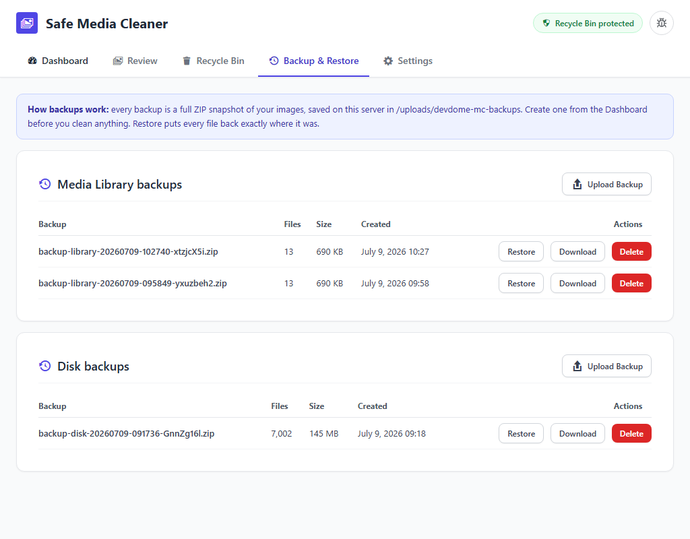
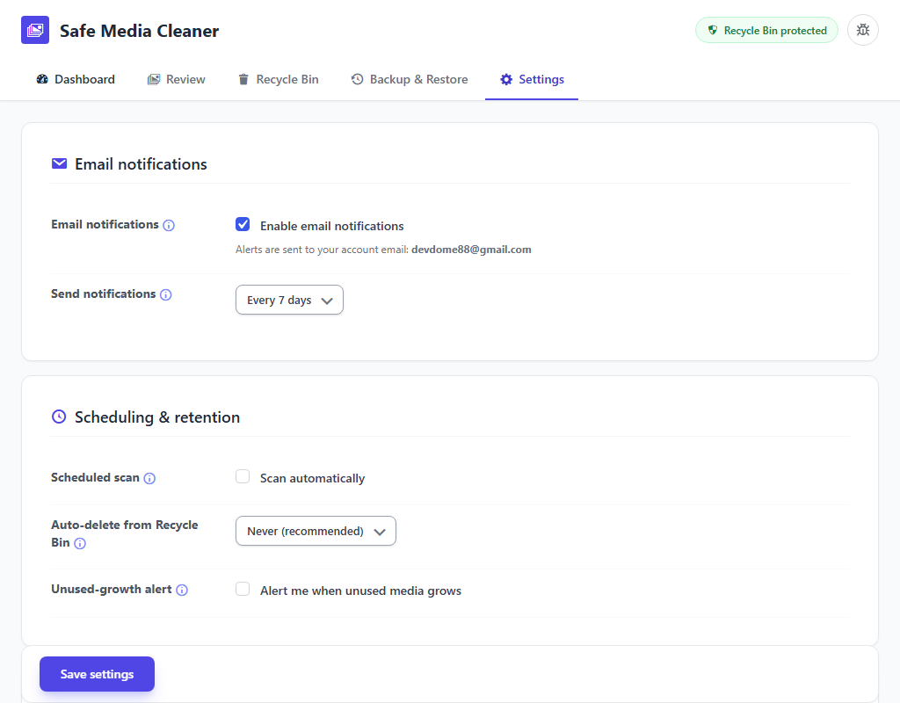

# DevDome Media Cleaner - free WordPress media cleaner for unused images, orphan files and duplicate media

**The free alternative to Media Cleaner Pro, Media Deduper, Image Cleanup and WPS Cleaner.**
Find unused images, orphan files and duplicate media in the WordPress Media Library and the
`uploads` folder, move them to a Recycle Bin, check your site, restore with one click or purge when ready.

- **Install from WordPress.org:** https://wordpress.org/plugins/devdome-safe-media-cleaner/
- **Website:** https://devdome.com
- **Support:** https://wordpress.org/support/plugin/devdome-safe-media-cleaner/

## Why DevDome Media Cleaner instead of the alternatives

| | DevDome Media Cleaner | Media Cleaner (Meow Apps) | Media Deduper | Image Cleanup | WP-Optimize / Smush |
|---|---|---|---|---|---|
| Unused images in the Media Library | Free | Free | No | No | No |
| Orphan files in the uploads folder | Free | Pro licence | No | Yes | No |
| Exact duplicate detection | Free | No | Yes | No | No |
| Recycle Bin with one-click restore | Yes | Trash | No | No | No |
| ZIP backup and restore of media | Yes | No | No | No | No |
| Background scanning on large libraries | Yes | Pro | No | No | n/a |
| Price | Free, no Pro tier | Pro from $29/yr | Free | Free | Compression only |

WP-Optimize and Smush compress the images you keep. DevDome Media Cleaner removes the ones you no longer use.

## Features

- **Unused image finder.** Before an image is marked unused it is checked against posts, pages, custom post
  types, page builders, widgets, menus, featured images, galleries, Gutenberg blocks, CSS backgrounds,
  responsive sizes (`srcset`) and WordPress options.
- **Orphan file scan.** Files that sit in `wp-content/uploads` with no Media Library record: leftovers from
  migrations, deleted plugins, failed uploads and manual FTP transfers.
- **Duplicate media detection.** Exact duplicates are grouped so you choose which copy to keep. Nothing is
  deleted automatically.
- **Recycle Bin first.** Selected media moves to a protected Recycle Bin. Check the site, restore in one
  click, purge only when you are sure.
- **Backup and restore.** Create, download, upload and restore ZIP backups of your media.
- **Review screen** with status labels, reasons, filters and bulk selection.
- **Scheduled scans, retention and protection rules** in Settings.
- **Runs on your own server.** Scanning, classification, Recycle Bin, backup and restore never leave your
  site. Connecting a DevDome account is optional and opt-in.

## Screenshots

*Dashboard: unused images, orphan files and duplicate media in the Media Library and uploads folder, with storage totals.*

*Unused images review: every unused image with the reason, status labels, filters and bulk selection.*

*Orphan files scan: files in the uploads folder that no longer have a Media Library record.*

*Recycle Bin: cleaned media kept in batches, restored with one click.*

*Backup and restore: create, download, upload and restore ZIP media backups.*

*Settings: scheduled scans, retention, protection rules and optional DevDome monitoring.*

## Requirements

WordPress 6.0+, PHP 7.4+. Tested up to WordPress 7.1.

## Installation

1. In wp-admin go to **Plugins > Add New**, search for **DevDome Media Cleaner**, install and activate.
2. Open **Media Cleaner** in the admin menu and run the first scan.
3. Review the results, move what you do not need to the Recycle Bin, purge later.

Or download the latest zip from [WordPress.org](https://wordpress.org/plugins/devdome-safe-media-cleaner/).

## Part of the DevDome plugin family

Free WordPress plugins by [DevDome](https://devdome.com): Analytics (cookieless, bot and AI crawler split),
Redirect Manager, Affiliate Manager, Link Monitor, Media Cleaner. Every plugin ships with the DevDome Dashboard
inside wp-admin, so you can install the others in one click.

## Development

This repository mirrors the release published on WordPress.org. Bug reports and feature requests: open an
issue here or use the [support forum](https://wordpress.org/support/plugin/devdome-safe-media-cleaner/).

## License

GPL-2.0 or later. See [LICENSE](LICENSE).
