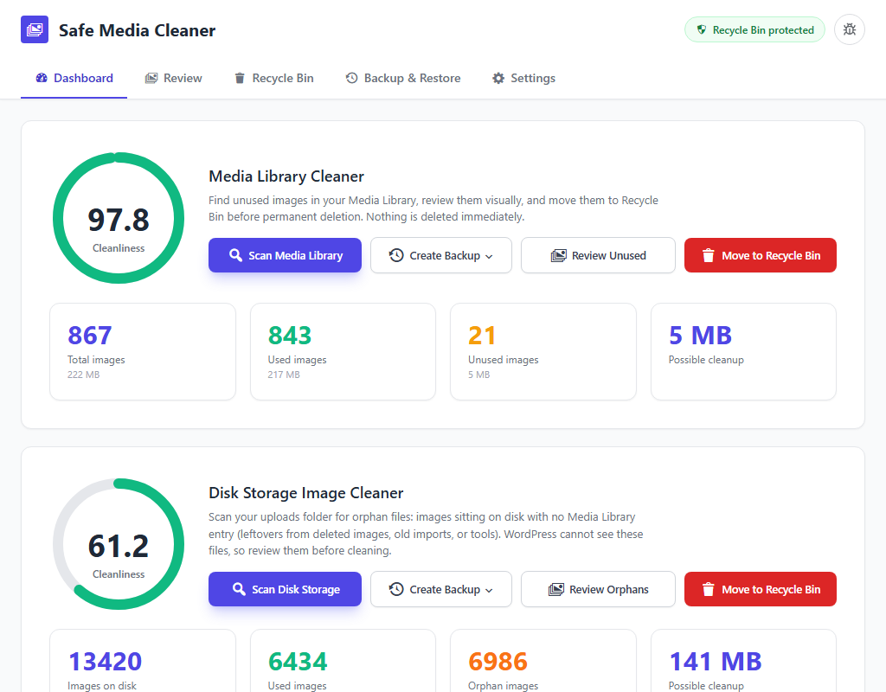
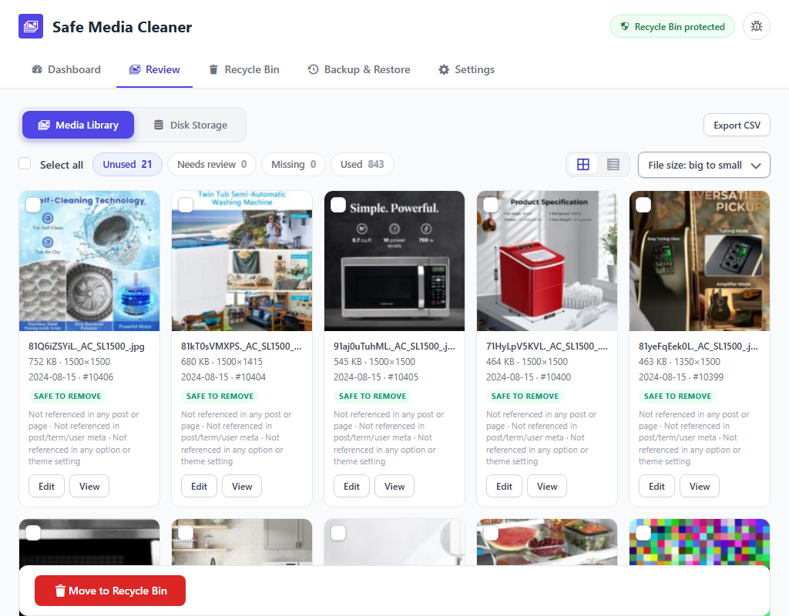
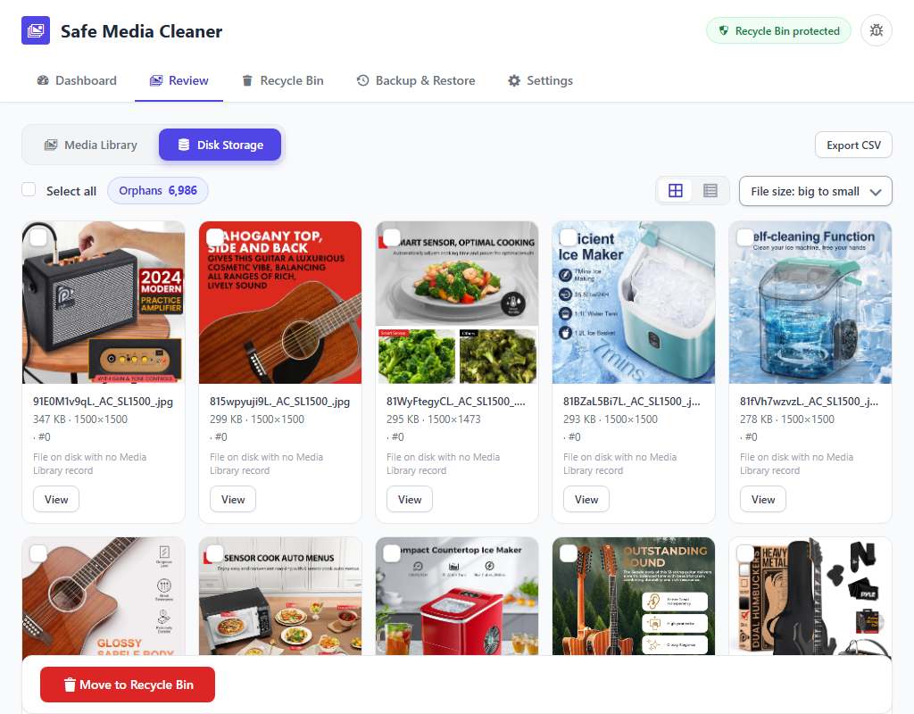
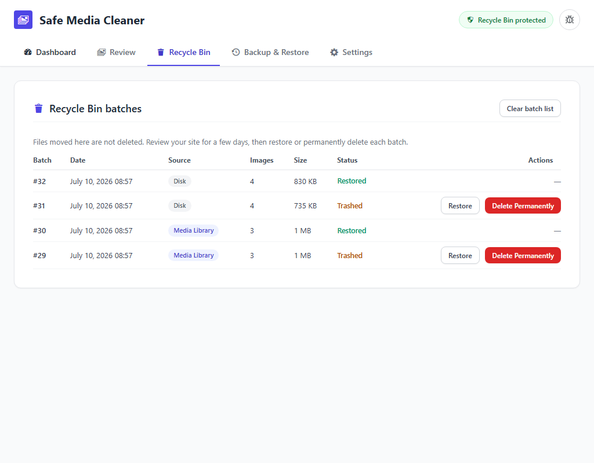
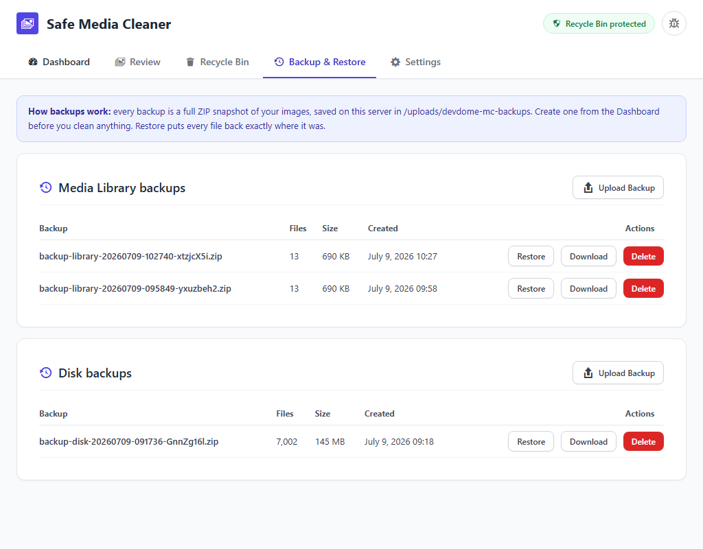
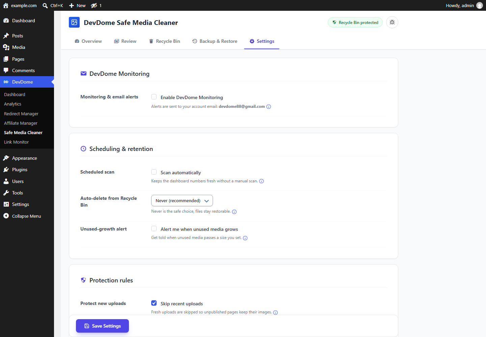

# DevDome Media Cleaner: Remove Unused Images # DevDome Media Cleaner: Remove Unused Images & Media Library Cleanup Media Library Cleanup

Find unused images and orphan images, view sizes and remove unused media; restore from the Recycle Bin or delete unused images after review. This free WordPress media cleaner runs on your own server, with ZIP backups and one-click restore. No account is required for cleanup.

**The free alternative to Media Cleaner Pro, Media Deduper, Image Cleanup and WPS Cleaner.**

- **Install from WordPress.org:** https://wordpress.org/plugins/devdome-safe-media-cleaner/
- **Website:** https://devdome.com
- **Support:** https://wordpress.org/support/plugin/devdome-safe-media-cleaner/

## Why DevDome Media Cleaner instead of the alternatives

| | DevDome Media Cleaner | Media Cleaner (Meow Apps) | Media Deduper | Image Cleanup | WP-Optimize / Smush |
|---|---|---|---|---|---|
| Unused images in the Media Library | Free | Free | No | No | No |
| Orphan files in the uploads folder | Free | Pro licence | No | Yes | No |
| Exact duplicate detection | Planned, not in 1.1.2 | No | Yes | No | No |
| Recycle Bin with one-click restore | Yes | Trash | No | No | No |
| ZIP backup and restore of media | Yes | No | No | No | No |
| Background scanning on large libraries | Yes | Pro | No | No | n/a |
| Price | Free, no Pro tier | Pro from $29/yr | Free | Free | Compression only |

Image compression reduces the size of images you keep. This cleaner helps you review and remove images you no longer use.

## Features

### Find unused images and orphan images

The scanner checks image references before classifying files:

- Posts, pages, custom post types, revisions, featured images and galleries.
- Gutenberg, reusable and synced blocks, CSS backgrounds, responsive sizes (`srcset`) and lazy-loading attributes.
- Widgets, navigation menus, site logos, site icons and WordPress options.
- Page-builder data, WooCommerce images, custom fields and SEO settings.

The disk scan finds orphan files in `wp-content/uploads` without a matching Media Library record, including thumbnails left behind by deleted images. These can remain after migrations, deleted plugins, failed uploads or manual FTP transfers. The disk scan covers images; other file types are left alone.

Unattached media is not necessarily unused. No scanner can detect every custom or hard-coded reference, so review the reasons and check your site before permanent deletion.

### Remove unused images with a media recycle bin

Image cleanup starts with review. Selected files move to a protected local Recycle Bin, where you can restore them to their original locations with one click.

- Each file is checked again immediately before moving.
- Recent uploads and uncertain files are not automatically selected.
- Status labels explain **Safe to remove**, **Needs manual review** and **Protected** findings.
- Create, download, upload and restore ZIP media backups.
- Choose when to delete unused images permanently.

Scheduled scans do not automatically delete media. On nginx, add a deny rule for `/wp-content/uploads/devdome-safe-trash/`; Apache and IIS protection rules are bundled.

### A clean media library workflow

Use the plugin for routine media library maintenance: scan, review, clean up selected images, then check your website.

The media manager provides a grid or list with:

- Filename search, status filters and bulk selection.
- Sorting by file size, dimensions or age.
- Thumbnails, upload dates, cleanup reasons and missing media findings.
- CSV export of scan results.

Review disk usage and sort flagged files by size to find the largest storage savings. Moving files to the Recycle Bin keeps them on disk; permanent deletion reclaims that space.

To bulk delete images or bulk delete media identified by the scanner, review the selection, move it to the Recycle Bin, and confirm deletion after checking your site.

### Background scans, settings and local processing

Scans run in small, resumable background batches for large libraries. Pause and resume without starting over. Scans, cleanups, backups and restores continue after you close the tab.

Settings include scheduled scans, retention and protection rules. Each multisite site keeps its own scans, Recycle Bin, backups and settings. WP-CLI commands are included.

Scanning, classification, cleanup, backup and restore run on your server. Optional DevDome Monitoring requires an opt-in account connection and sends aggregate scan statistics to track growth and alert you at a chosen threshold. It sends no media files, filenames, image URLs or visitor data.

## Screenshots

*Dashboard: unused images and orphan files in the Media Library and uploads folder, with storage totals.*

*Unused images review: every unused image with the reason, status labels, filters and bulk selection.*

*Orphan files scan: files in the uploads folder that no longer have a Media Library record.*

*Recycle Bin: cleaned media kept in batches, restored with one click.*

*Backup and restore: create, download, upload and restore ZIP media backups.*

*Settings: scheduled scans, retention, protection rules and optional DevDome monitoring.*

## Requirements

WordPress 6.0+, PHP 7.4+. Tested up to WordPress 7.1.

## Installation

1. In wp-admin go to **Plugins > Add New**, search for **DevDome Media Cleaner**, install and activate.
2. Open **DevDome > Safe Media Cleaner** and select **Scan Media Library**.
3. Review the results and move selected files to the **Recycle Bin**.
4. Check your site, then restore anything you need or confirm permanent deletion.

Or download the latest zip from [WordPress.org](https://wordpress.org/plugins/devdome-safe-media-cleaner/).

## Part of the DevDome plugin family

Free WordPress plugins by [DevDome](https://devdome.com): Analytics (cookieless, bot and AI crawler split), Redirect Manager, Affiliate Manager, Link Monitor, Media Cleaner.

Every plugin ships with the DevDome Dashboard inside wp-admin, so you can install the others in one click. Activate each plugin from its card after installation.

## Development

This repository mirrors the release published on WordPress.org. Bug reports and feature requests: open an issue here or use the [support forum](https://wordpress.org/support/plugin/devdome-safe-media-cleaner/).

## License

GPL-2.0 or later. See [LICENSE](LICENSE).
